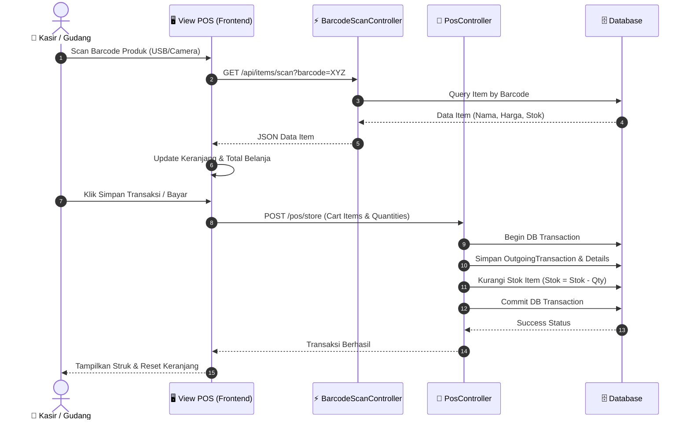
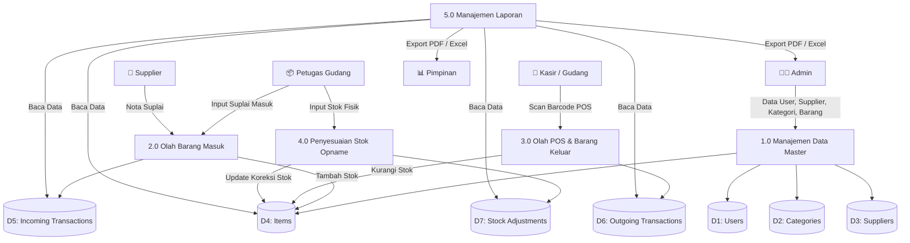
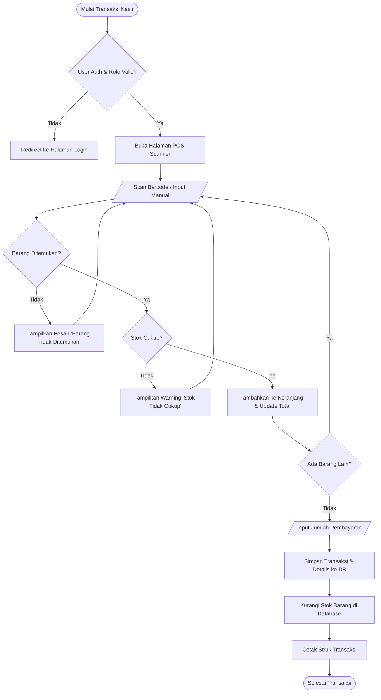
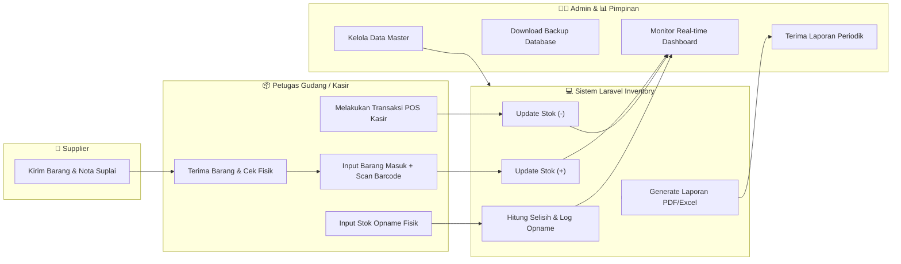

# 🛒 Sistem Informasi Manajemen Inventaris & POS Kasir Barcode

[](https://laravel.com)
[](https://php.net)
[](https://vitejs.dev)
[](https://tailwindcss.com)
[](https://sqlite.org)

Sistem Informasi Manajemen Inventarisasi Barang dan Kasir Point of Sale (POS) berbasis web berbasis framework **Laravel 12**. Sistem ini dilengkapi dengan integrasi pemindai barcode (*barcode scanner*), pelacakan stok otomatis, manajemen transaksi barang masuk & keluar, penyesuaian stok opname, serta ekspor laporan berbasis PDF/Excel.

---

## 📌 Daftar Isi
- [Fitur Utama](#-fitur-utama)
- [Teknologi yang Digunakan](#-teknologi-yang-digunakan)
- [Panduan Instalasi & Penggunaan](#-panduan-instalasi--penggunaan)
- [Alur & Cara Kerja Sistem](#-alur--cara-kerja-sistem)
- [Permodelan Sistem (Diagram & Flowchart)](#-permodelan-sistem-diagram--flowchart)
  - [1. Use Case Diagram (UML)](#1-use-case-diagram-uml)
  - [2. Entity Relationship Diagram (ERD / Class Diagram)](#2-entity-relationship-diagram-erd--class-diagram)
  - [3. Sequence Diagram (UML)](#3-sequence-diagram-uml)
  - [4. Data Flow Diagram (DFD Level 0 & Level 1)](#4-data-flow-diagram-dfd)
  - [5. Flowchart Transaksi POS Barcode](#5-flowchart-transaksi-pos-barcode)
  - [6. Flowmap (Proses Bisnis Sistem)](#6-flowmap-proses-bisnis-sistem)
- [Hak Akses Pengguna (RBAC Matrix)](#-hak-akses-pengguna-rbac-matrix)
- [Struktur Folder Projek](#-struktur-folder-projek)

---

## ✨ Fitur Utama

- 🔍 **Barcode Scanner Integration**: Mendukung pemindaian barcode cepat via scanner USB/Wireless maupun kamera untuk transaksi POS & input barang.
- 📦 **Manajemen Stok Otomatis**: Stok bertambah otomatis saat transaksi barang masuk dan berkurang otomatis saat transaksi kasir/barang keluar.
- 🏷️ **Cetak Barcode Produk**: Generasi dan cetak label barcode produk secara kolektif langsung dari sistem.
- 🛒 **Point of Sale (POS) Kasir**: Antarmuka kasir cepat untuk pemrosesan transaksi penjualan barang secara real-time.
- 📊 **Penyesuaian Stok (Stock Opname)**: Pencatatan selisih antara stok fisik di gudang dengan stok sistem beserta alasannya.
- 📑 **Laporan & Ekspor Data**: Ekspor laporan barang masuk, barang keluar, dan rekapan stok ke format PDF dan Excel.
- 💾 **Backup Database**: Fitur sekali klik untuk mengunduh backup database sistem.
- 🔐 **Multi-Role Access (RBAC)**: Pembagian hak akses terintegrasi untuk Admin, Petugas Gudang/Kasir, dan Pimpinan.

---

## 🛠️ Teknologi yang Digunakan

- **Backend Framework**: Laravel 12.x (PHP 8.3+)
- **Frontend & Styling**: Blade, Vite 8.x, Tailwind CSS 4.x
- **Database**: SQLite (Default lokal) / MySQL
- **Concurrency & Scripting**: Node.js, `concurrently` (menjalankan Artisan Serve, Queue, dan Vite bersamaan)
- **Automated Windows Runners**: File `setup.bat` dan `start.bat` untuk eksekusi sekali klik.

---

## 🚀 Panduan Instalasi & Penggunaan

### Cara 1: Menggunakan Automatic Runner (Rekomendasi di Windows)

1. **Setup Otomatis (Pertama Kali)**:
   Jalankan file `setup.bat` dengan melakukan **double-click**. File ini akan secara otomatis:
   - Memeriksa PHP, Composer, dan Node.js di Laragon / XAMPP / System PATH.
   - Mengaktifkan ekstensi `pdo_sqlite` jika diperlukan.
   - Membuat file `.env` dan `database.sqlite`.
   - Menginstall dependensi Composer & NPM.
   - Meng-generate App Key, Storage Link, serta migrasi database.
   - Mengompilasi assets Vite (`npm run build`).

2. **Jalankan Aplikasi Kapan Saja**:
   Cukup **double-click** file `start.bat`. Server akan langsung berjalan di:
   👉 **`http://127.0.0.1:8000`**

### Cara 2: Perintah Manual via Terminal

```bash
# 1. Clone repository & masuk ke folder projek
git clone <repository-url>
cd "web wann"

# 2. Install dependensi PHP & Node.js
composer install
npm install

# 3. Setup Environment & Database
copy .env.example .env
php artisan key:generate
type nul > database\database.sqlite   # Untuk Windows Command Prompt
php artisan storage:link
php artisan migrate --force

# 4. Compile Frontend Assets & Menjalankan Server
composer run dev
```

---

## 🔄 Alur & Cara Kerja Sistem

1. **Autentikasi Pengguna**: Pengguna melakukan login menggunakan kredensial yang terdaftar. Sistem membaca *role* pengguna (Admin, Gudang, atau Pimpinan).
2. **Pengelolaan Data Master**: Admin menginputkan Kategori, Supplier, dan Data Barang (termasuk kode barcode, stok awal, stok minimal, harga beli, dan harga jual).
3. **Penerimaan Barang (Barang Masuk)**: Petugas Gudang mencatat penerimaan barang dari Supplier. Stok barang di database bertambah secara otomatis.
4. **Penjualan / Penyerahan (POS Kasir / Barang Keluar)**:
   - Kasir membuka menu POS Scanner dan memindai barcode barang.
   - Sistem secara instan mencari barang via API endpoint `/api/items/scan`.
   - Kasir mengonfirmasi transaksi. Stok barang berkurang secara otomatis.
5. **Stock Opname**: Petugas menginputkan stok fisik terkini. Jika ada perbedaan, sistem mencatat selisih dan meng-update stok sistem.
6. **Pelaporan**: Admin/Pimpinan melihat grafik dashboard, ringkasan transaksi, serta mengunduh laporan fisik dalam bentuk PDF atau Excel.

---

## 📊 Permodelan Sistem (Diagram & Flowchart)

### 1. Use Case Diagram (UML)

Diagram ini menggambarkan interaksi antara aktor (Admin, Petugas Gudang/Kasir, Pimpinan) dengan fungsi-fungsi utama dalam sistem.

```mermaid
graph TD
    subgraph System ["Sistem Inventaris & POS Kasir Barcode"]
        UC1["1. Login & Autentikasi"]
        UC2["2. Kelola User & Hak Akses"]
        UC3["3. Kelola Supplier & Kategori"]
        UC4["4. Kelola Master Data Barang & Barcode"]
        UC5["5. POS Scanner & Transaksi Kasir"]
        UC6["6. Kelola Transaksi Barang Masuk"]
        UC7["7. Kelola Transaksi Barang Keluar"]
        UC8["8. Penyesuaian Stok (Opname)"]
        UC9["9. Cetak Barcode & Label Produk"]
        UC10["10. Lihat & Export Laporan (PDF/Excel)"]
        UC11["11. Download Backup Database"]
    end

    Admin["👨‍💼 Admin"] --> UC1
    Admin --> UC2
    Admin --> UC3
    Admin --> UC4
    Admin --> UC5
    Admin --> UC6
    Admin --> UC7
    Admin --> UC8
    Admin --> UC9
    Admin --> UC10
    Admin --> UC11

    Gudang["📦 Petugas Gudang / Kasir"] --> UC1
    Gudang --> UC4
    Gudang --> UC5
    Gudang --> UC6
    Gudang --> UC7
    Gudang --> UC8
    Gudang --> UC9
    Gudang --> UC10
    Gudang --> UC11

    Pimpinan["📊 Pimpinan / Manager"] --> UC1
    Pimpinan --> UC4
    Pimpinan --> UC10
```



---

### 2. Entity Relationship Diagram (ERD / Class Diagram)

Diagram berikut menampilkan struktur entitas database beserta relasi antar tabel:

```mermaid
erDiagram
    USERS {
        int id PK
        string name
        string email
        string role "admin, gudang, pimpinan"
        timestamp created_at
    }
    CATEGORIES {
        int id PK
        string code
        string name
    }
    SUPPLIERS {
        int id PK
        string name
        string phone
        string address
    }
    ITEMS {
        int id PK
        int category_id FK
        string barcode UK
        string name
        int stock
        int min_stock
        decimal purchase_price
        decimal selling_price
    }
    INCOMING_TRANSACTIONS {
        int id PK
        int supplier_id FK
        int user_id FK
        string transaction_code UK
        date transaction_date
    }
    INCOMING_TRANSACTION_DETAILS {
        int id PK
        int incoming_transaction_id FK
        int item_id FK
        int quantity
        decimal purchase_price
    }
    OUTGOING_TRANSACTIONS {
        int id PK
        int user_id FK
        string transaction_code UK
        date transaction_date
        decimal total_amount
    }
    OUTGOING_TRANSACTION_DETAILS {
        int id PK
        int outgoing_transaction_id FK
        int item_id FK
        int quantity
        decimal selling_price
    }
    STOCK_ADJUSTMENTS {
        int id PK
        int item_id FK
        int user_id FK
        int system_stock
        int actual_stock
        int adjustment_amount
        string reason
    }

    CATEGORIES ||--o{ ITEMS : "kategori dari"
    SUPPLIERS ||--o{ INCOMING_TRANSACTIONS : "menyuplai"
    USERS ||--o{ INCOMING_TRANSACTIONS : "mencatat masuk"
    INCOMING_TRANSACTIONS ||--|{ INCOMING_TRANSACTION_DETAILS : "memiliki detail"
    ITEMS ||--o{ INCOMING_TRANSACTION_DETAILS : "item masuk"
    USERS ||--o{ OUTGOING_TRANSACTIONS : "memproses kasir"
    OUTGOING_TRANSACTIONS ||--|{ OUTGOING_TRANSACTION_DETAILS : "memiliki detail"
    ITEMS ||--o{ OUTGOING_TRANSACTION_DETAILS : "item keluar"
    ITEMS ||--o{ STOCK_ADJUSTMENTS : "disesuaikan"
    USERS ||--o{ STOCK_ADJUSTMENTS : "mencatat opname"
```



---

### 3. Sequence Diagram (UML)

Menjelaskan alur waktu dan pertukaran pesan saat Kasir melakukan transaksi POS dengan pemindaian barcode:



---

### 4. Data Flow Diagram (DFD)

#### DFD Context Diagram (Level 0)
Diagram konteks menggambarkan batasan sistem dan entitas luar yang berinteraksi dengannya:

```mermaid
graph TD
    Admin["👨‍💼 Admin"] <-->|Input Master, Transaksi, User / Terima Laporan & Backup| System["0.0 Sistem Informasi Inventaris & POS Barcode"]
    Gudang["📦 Petugas Gudang / Kasir"] <-->|Input Barang Masuk/Keluar, Scan POS, Opname / Terima Struk| System
    Pimpinan["📊 Pimpinan"] <-- Terima Laporan Stok & Transaksi (PDF/Excel) | System
    Supplier["🏢 Supplier"] -->|Suplai Barang & Nota| System
```

#### DFD Level 1
Detail proses bisnis internal di dalam sistem:



---

### 5. Flowchart Transaksi POS Barcode

Langkah-langkah logika pemrosesan transaksi kasir dari scan barcode hingga cetak struk:



---

### 6. Flowmap (Proses Bisnis Sistem)

Flowmap yang menggambarkan aliran dokumen dan informasi antar bagian:



---

## 🔐 Hak Akses Pengguna (RBAC Matrix)

| Fitur / Modul | Admin (`admin`) | Petugas Gudang / Kasir (`gudang`) | Pimpinan (`pimpinan`) |
| :--- | :---: | :---: | :---: |
| **Login & Dashboard** | ✅ | ✅ | ✅ |
| **Kelola User & Role** | ✅ | ❌ | ❌ |
| **Kelola Supplier & Kategori** | ✅ | ❌ | ❌ |
| **Tambah / Edit / Hapus Barang** | ✅ | ❌ | ❌ |
| **Lihat List Barang & Cetak Barcode** | ✅ | ✅ | ✅ |
| **POS Scanner & Barang Keluar** | ✅ | ✅ | ❌ |
| **Input Barang Masuk** | ✅ | ✅ | ❌ |
| **Input Stock Adjustment (Opname)** | ✅ | ✅ | ❌ |
| **Lihat & Export Laporan (PDF/Excel)**| ✅ | ✅ | ✅ |
| **Download Backup Database** | ✅ | ✅ | ❌ |

---

## 📂 Struktur Folder Projek

```text
web wann/
├── app/
│   ├── Http/
│   │   ├── Controllers/       # Controller utama (POS, Items, Reports, Auth, dll)
│   │   └── Middleware/        # RoleMiddleware & Auth Checkers
│   └── Models/                # Eloquent Models (Item, Supplier, Transactions, dll)
├── bootstrap/
├── config/
├── database/
│   ├── factories/
│   ├── migrations/            # Migration skema tabel database
│   └── seeders/
├── public/                    # Compiled assets & public storage link
├── resources/
│   ├── css/                   # Stylesheet & Tailwind CSS Setup
│   ├── js/                    # JavaScript & Vite Entry
│   └── views/                 # Blade Templates & Layouts
├── routes/
│   └── web.php                # Definisi seluruh route aplikasi
├── setup.bat                  # Script instalasi otomatis Windows
├── start.bat                  # Script runner cepat server local
├── composer.json
├── package.json
└── vite.config.js
```

---

## 📄 Lisensi

Projek ini berlisensi [MIT License](LICENSE).
